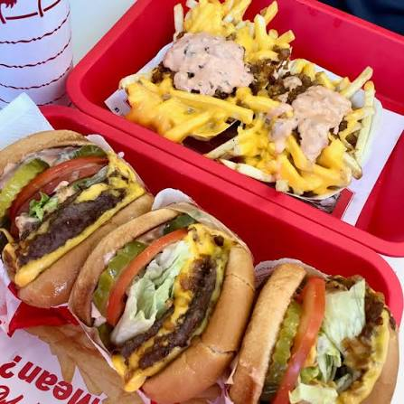
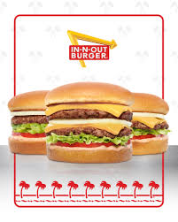

<!DOCTYPE html>
<html lang="en">
  <head>
    <meta charset="UTF-8" />
    <meta name="viewport" content="width=device-width, initial-scale=1.0" />
    <meta http-equiv="X-UA-Compatible" content="ie=edge" />
    <title>HTML + CSS</title>
    <link rel="stylesheet" href="styles.css" />
  </head>
  <body>
    <h1 style="color:yellow">Rebeca Diaz's In-n-Out Obsession Page</h1>
    <h2> 
         
         
    <h3 style="color:yellow"> <ul>
      <li>When it opened on October 22, 1948, it was California’s very first drive-thru hamburger stand.</li>
      <li>Founded by Harry and Esther Snyder in Baldwin Park, California</li>
      <li>Kids under the age of 12 can get a completely free hot cocoa at any location on rainy or snowy days.</li>
    </ul>
  </h3>
    <style> html{background-image: url(innout.jpeg);
    background-size:;
    background-attachment: fixed;}
    h1 {text-align: center;}
    h2 {text-align: center;}
    h3 {text-align: center;}
  </body>
</html>
